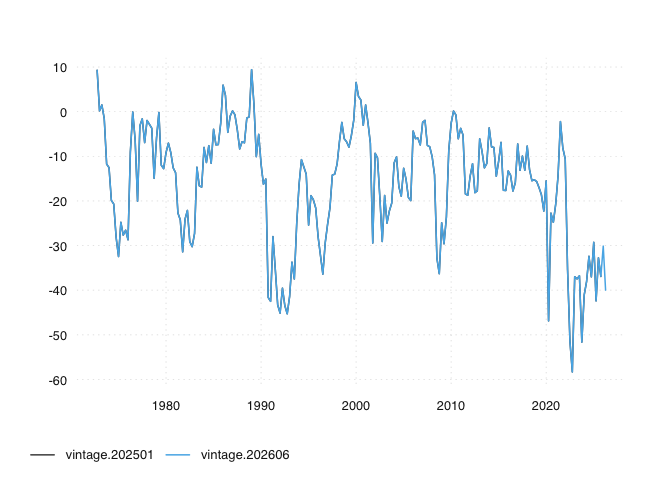

# ch.seco.css

The ch.seco.css package provides versioned time series data and their
meta information for scientific research. In addition, the package
contains the extract-transform-load (ETL) functionality that sources the
data from its original provider.

## Browse Time Series Data

You can use GitHub’s ability to render to csv to explore the datasets

## Basic Data Consumption via opentimeseries

``` r
remotes::install_github("opentsi/opentimeseries")
library(opentimeseries)

# first param `series` defaults to NULL
# fetches all series from `remote_archive`
ts <- read_open_ts(
  remote_archive = "opentsi/ch.seco.css"
)

ts
```

Given a unique time series identifier and a GitHub repo,
*opentimeseries* will return a time series and long format `data.table`.

## Basic Usage

``` r
ts <- read_open_ts(
  remote_archive = "opentsi/ch.seco.css"
)
```

By specifying a date in addition, you can able to obtain other versions
but the most recent one. The *opentimeseries* package will simply select
the most recent release that was available at the selected date.

Because time series data can get revised, storing vintages is important
to monitor data revisions and benchmark forecasts. Here’s a quick visual
comparison:

``` r
library(opentimeseries)
library(tsbox)

ts_current <- read_open_ts(series = "q.index.na.i63_index",
  remote_archive = "opentsi/ch.seco.css"
)
ts_older <- read_open_ts(series = "q.index.na.i63_index",
    remote_archive = "opentsi/ch.seco.css",
    date = "2026-01-01"
)

ts_older$id <- "vintage.202501"
ts_current$id <- "vintage.202606"
ts_plot(rbind(ts_older, ts_current))
#> [time]: 'date'
```

<!-- -->

<!-- last_dates <- tail(sort(unique(ts_older$date)), 10)
ts_older <- ts_older[ts_older$date %in% last_dates, ]
ts_current <- ts_current[ts_current$date %in% last_dates, ] -->
